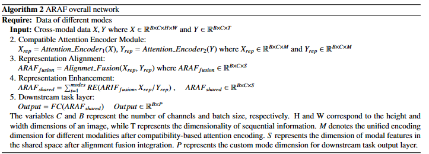

# Attention-based cross-modal representation alignment and fusion mechanism for multitasks

Cross-modal representation alignment is a critical mechanism for integrating multi-modal data. This technique involves the iterative transmission and enhancement of feature representations between different modalities to effectively integrate multi-modal information and generate a unified representation in the feature space. However, existing methods often struggle with feature dimension mismatches, representation space inconsistencies, and lack of adaptability to diverse downstream tasks. To address these challenges, we propose Attention-based Representation Alignment Fusion (ARAF), a promising approach that is highly compatible and robust in capturing cross-modal representation information. It enhances model performance by implementing a consistent alignment fusion mechanism. The proposed method outperforms other popular multi-modal fusion approaches in various tasks, including regression, classification, and image generation. This superiority is consistently demonstrated through extensive empirical evaluations on multiple datasets. The results consistently indicate that the Attention Representation Alignment Fusion method achieves state-of-the-art performance in these tasks. 

## 1. Requirements
- PyTorch >= 1.10.1
- python >= 3.7
- Einops = 0.6.1
- numpy = 1.24.3 
- torchvision = 0.9.1+cu111 
- scikit-learn = 1.2.2  
- CUDA >= 11.3

## 2. Data preparation
We use the [VQA](https://visualqa.org/vqa_v1_download.html) as classification dataset.

We use the [ETDdataset](https://github.com/zhouhaoyi/ETDataset) as regression dataset.

We use the [CUB](https://paperswithcode.com/dataset/cub-200-2011) as image generation dataset.

We use these three datasets to test the multimodal fusion performance.

## Process and dimension

  

## 3. Method
### Overall Structure
We provide a detailed architecture of the  Attention Representation Alignment Fusion network framework we propose for cross-modal information, which comprises three main modules: ARAF encoder module, Representation Alignment module, and Representation Enhancement module. Note that the model uses three different types of cross-modal information including image, text, and time series information in diverse downstream tasks.

###  Compatible Attention Encoder
The ARAF Encoder is a unified component for cross-modal feature extraction. This encoder leverages attention mechanisms and the Modality Fusion Enhancement (MFE) module to better focus on relevant portions of cross-modal representation information. This structure effectively transforms information from different modalities into a common sequence data format, unifying the representation of diverse modal data, and thereby reducing heterogeneity and representation differences among different modalities.

## 4.  Experiment
In this section, we evaluate and visualize classification, regression, and generation tasks separately.
### Classification

  

This experiment focuses on the classification task related to Visual Question Answering (VQA). The experiment clearly demonstrates the difference in model performance when using the ARAF (Alignment-based Adaptive Fusion) framework compared to not using the ARAF framework. The experimental results are presented through ROC curve graphs. The shape and position of the ROC curve can effectively reflect the model's performance and robustness. From the experimental results, the network utilizing the ARAF framework exhibits superior performance, as evidenced by a larger area under the ROC curve. The alignment fusion module of ARAF can effectively capture complex feature information from different modalities and integrate them, achieving superior performance in the classification task.

### Regression

The first scatter plot illustrates the relationship between predicted values and actual labels when using the ARAF framework. The points on the plot are distributed along the diagonal, indicating a strong fit between the predicted and actual values. The second scatter plot demonstrates minimal differences between predicted values and true values under the ARAF framework. This indicates that the design of the ARAF framework not only enables flexible capturing of the underlying features of time series data but also effectively enhances the accuracy of regression predictions. This impressive performance is attributed to the powerful adaptive encoder structure of the ARAF framework, which can effectively capture and encode time series data, and the alignment capability of the fusion module to integrate information from different time steps.

### Generation

In image generation tasks, it is evident that bird images generated using the ARAF framework exhibit higher quality and stronger textual coherence. This advantage stems from the ARAF framework's adaptive ability to capture crucial feature information from both images and text, and its utilization of a powerful fusion alignment module for image-text matching. Additionally, the ARAF framework enhances the semantic information through its representation enrichment module, further improving the quality of the generated images.

## Alignment and Fusion Mechanism Visualization

  

  

To effectively evaluate the role of core modules in the ARAF framework, we visualized the states of various modal data.

1. The top-left figure displays the distribution of the original cross-modal data. This figure illustrates the initial distribution of different modalities.

2. The top-right figure depicts the data space distribution after the modules process the two modalities through our unified attention encoder. It is evident that the unified attention encoder effectively brings cross-modal information closer together and performs unified encoding operations.

3. The bottom-left figure showcases the visible and distinctive cross-modal information that is fully aligned and fused in a shared representation space using the aggregation fusion display module. This figure demonstrates the module's effective utilization of cross-modal information.

4. The bottom-right figure shows the data space distribution after undergoing the representation enhancement module. It can be observed that the cross-modal information is further sparsely fused, enhancing the expression of fusion features.

##  Comparison of ARAF with other Fusion Methods

  

## 4. Training and evaluation
Train &  Test: run Train_Test.py

