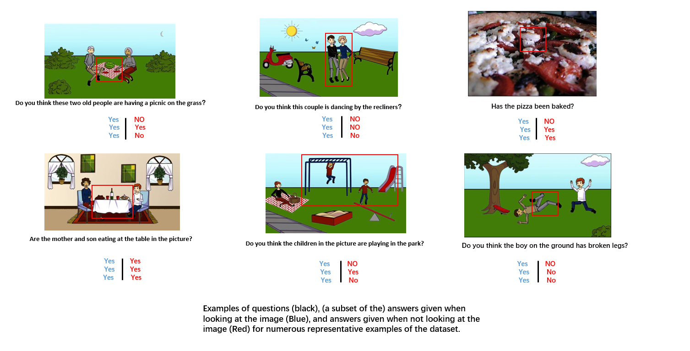
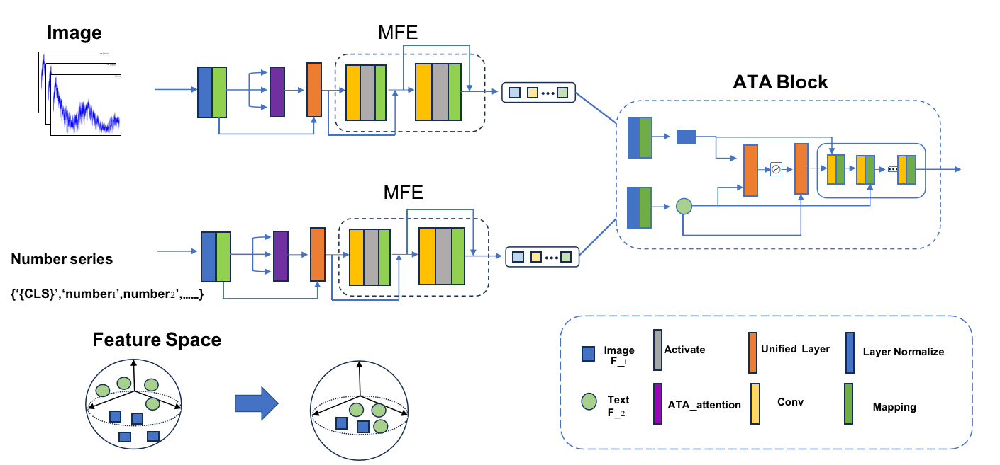
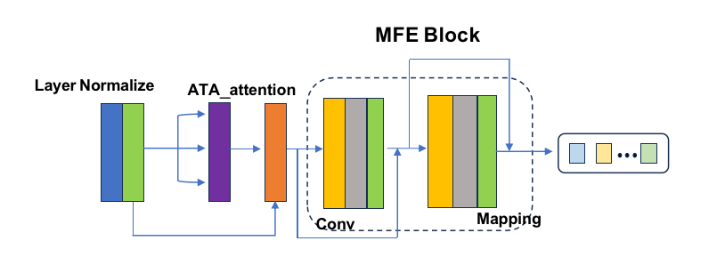
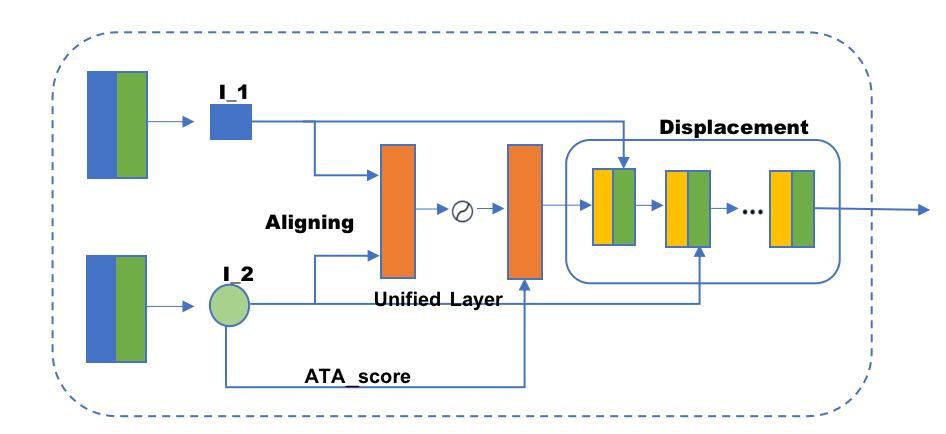
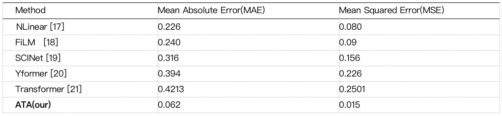

# A multimode fusion method under multi-task 

Feature tensor alignment constitutes the primary mechanism for fusing multimodal data. we propose a novel fusion approach termed Attentive Tensor Alignment. This technique iteratively transfers and augments feature representations across modalities to fully integrate the multimodal information, thereby attaining a unified representation in feature space. The Attentive Tensor Alignment approach robustly captures high-level interactions between features from distinct modalities, substantially enhancing multimodal learning performance. Through extensive empirical evaluations on the DPTODataset, a power transformer temperature detection dataset, we demonstrate that our proposed technique achieves state-of-the-art results. Compared to alternative fusion techniques, our approach exhibits remarkable performance gains and excels in its lightweight characteristics. 

We prepared to submit this article to **Expert System With Application**

## 1. Requirements
- PyTorch >= 1.10.1
- python >= 3.7
- Einops = 0.6.1
- numpy = 1.24.3 
- torchvision = 0.9.1+cu111 
- scikit-learn = 1.2.2  
- CUDA >= 11.3

## 2. Data preparation
We use the [VQA](https://visualqa.org/vqa_v1_download.html) as training dataset.

We use the [ETDdataset](https://github.com/zhouhaoyi/ETDataset) and [CUB](https://paperswithcode.com/dataset/cub-200-2011) as testset to test the multimodal fusion performance.

## 3. Method
The model in this study consists of two main components: the ATA_Encoder module and the Alignment module. A unified cross-modal feature extraction module is employed as a shared component between the two encoder sections. In Figure 1, the overall framework structure is illustrated, accompanied by a comprehensive explanation and elaboration.

The ATA-Encoder assumes a central role as a core component, specifically crafted to facilitate cross-modal feature extraction between image and time series data. It features a multi-level stacked architecture, incorporating multiple ATA-attention encoder sub-modules. Each ATA-attention encoder is further augmented with a Multimodal Feature Extraction (MFE) block, tasked with conducting additional nonlinear transformations and sequence modelling tailored to the unique characteristics of each modality. Within this multi-level configuration, the original image and time series inputs undergo progressive abstraction via the ATA-Encoder, resulting in the extraction of increasingly high-level features.
The MFE block, nested within each ATA-attention encoder level, plays a pivotal role in augmenting the representational capacity of each modality. This enhancement is achieved through the application of tailored nonlinear operations and sequence modelling techniques. The ATA-Encoder operates on these principles to effectively extract salient features from the cross-modal data. The specific working principle is as follows:

We first use the previously described ATA-encoder architecture for initial feature extraction. While this process derives informative representations for each modality, inherent structural and geometric differences exist due to their heterogeneous nature. To effectively integrate these diverse features, we design the Alternating Tensor Alignment (ATA) module to synergistically merge visual and temporal streams into a unified representation. The core technological innovation of the ATA module involves selective and alternating transformations of feature matrices for both image and time series data. Specifically, this alternating transformation scheme projects the modalities into a shared, coordinated embedding subspace. In this joint space, the representations are geometrically and statistically aligned, capturing the complementary properties of both data sources. The integrated feature matrix possesses cross-modal compatibility and interoperability. Below is the working principle of ATA:

## 4. Training and evaluation
**Training: run MultiModalEnhancer.py**

**Testing: run Train_Test.py**

## 5. Result:
We selected a highly representative power transformer temperature detection dataset for experimentation to demonstrate the excellent performance of the ATA method in transformer temperature detection techniques. Furthermore, to establish the sufficiency of our experiments on multimodal data, we conducted separate experiments on this dataset using single-modal data. Finally, to validate that our proposed ATA method is a superior cross-modal alignment approach, we performed experiments by replacing the ATA module in our model with two traditional alignment methods.

    
     
    

     Comparision with previous state-of-the-art method on DPTODataset
    

