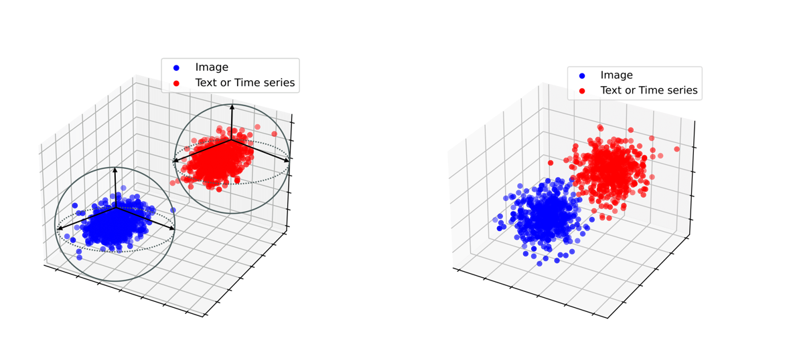

# Attention-based cross-modal representation alignment and fusion mechanism for multitasks

Cross-modal representation alignment is a critical mechanism for integrating multi-modal data. This technique involves the iterative transmission and enhancement of feature representations between different modalities to effectively integrate multi-modal information and generate a unified representation in the feature space. However, existing methods often struggle with feature dimension mismatches, representation space inconsistencies, and lack of adaptability to diverse downstream tasks. To address these challenges, we propose Attention-based Representation Alignment Fusion (ARAF), a promising approach that is highly compatible and robust in capturing cross-modal representation information. It enhances model performance by implementing a consistent alignment fusion mechanism. The proposed method outperforms other popular multi-modal fusion approaches in various tasks, including regression, classification, and image generation. This superiority is consistently demonstrated through extensive empirical evaluations on multiple datasets. The results consistently indicate that the Attention Representation Alignment Fusion method achieves state-of-the-art performance in these tasks. 

## 1. Requirements
- PyTorch >= 1.10.1
- python >= 3.7
- Einops = 0.6.1
- numpy = 1.24.3 
- torchvision = 0.9.1+cu111 
- scikit-learn = 1.2.2  
- CUDA >= 11.3

## 2. Data preparation
We use the [VQA](https://visualqa.org/vqa_v1_download.html) as classification dataset.

We use the [ETDdataset](https://github.com/zhouhaoyi/ETDataset) as regression dataset.

We use the [CUB](https://paperswithcode.com/dataset/cub-200-2011) as image generation dataset.

We use these three datasets to test the multimodal fusion performance.

## 3. Method
### Overall Structure
We provide a detailed architecture of the  Attention Representation Alignment Fusion network framework we propose for cross-modal information, which comprises three main modules: ARAF encoder module, Representation Alignment module, and Representation Enhancement module. Note that the model uses three different types of cross-modal information including image, text, and time series information in diverse downstream tasks.

###  Compatible Attention Encoder
The ARAF Encoder is a unified component for cross-modal feature extraction. This encoder leverages attention mechanisms and the Modality Fusion Enhancement (MFE) module to better focus on relevant portions of cross-modal representation information. This structure effectively transforms information from different modalities into a common sequence data format, unifying the representation of diverse modal data, and thereby reducing heterogeneity and representation differences among different modalities.

## 4.  Expeiment
In this section, we evaluate and visualize classification, regression, and generation tasks separately.
### Classification

  

In this laboratory, our primary focus is on the five-class prediction task for Visual Question Answering (VQA). We conducted a comparative experiment to illustrate the disparities in prediction results when employing the ARIF Framework versus not utilizing it. The experimental results are presented through ROC (Receiver Operating Characteristic) curve plots, where the network utilizing the ARIF Framework exhibits superior performance, as indicated by a larger area under the ROC curve. This indicates that the ARIF Framework plays a positive role in enhancing the performance of VQA tasks.

### Regression

To visualize the effectiveness of ECG prediction regression tasks, especially the difference between using and not using the ARIF framework, we can create an image. This image will display two scatterplots: one to illustrate the relationship between predicted results and true labels when using the ARIF framework, and the other to show the relationship without using the ARIF framework. In each scatterplot, the points will be distributed along the diagonal line, indicating the closeness between predicted values and actual values. Through this comparison, the utility of the ARIF framework in ECG prediction can be clearly observed.

### Generation

We may use the CUB dataset to generate a picture that shows the experimental outcomes, demonstrating the efficacy of the ARIF framework in image-generating tasks. This picture will display many bird images created with the ARIF framework, which combines visual characteristics and semantic information received as input. These images demonstrate that the ARIF framework effectively generates high-quality, clear, and semantically aligned bird images.

## Alignment and Fusion Mechanism Visualization

  

  

 
##   Comparison of ARAF with other  Method  in different Task

##  Comparison of ARAF with other Fusion Method

  

## 4. Training and evaluation
Train &  Test: run Train_Test.py

